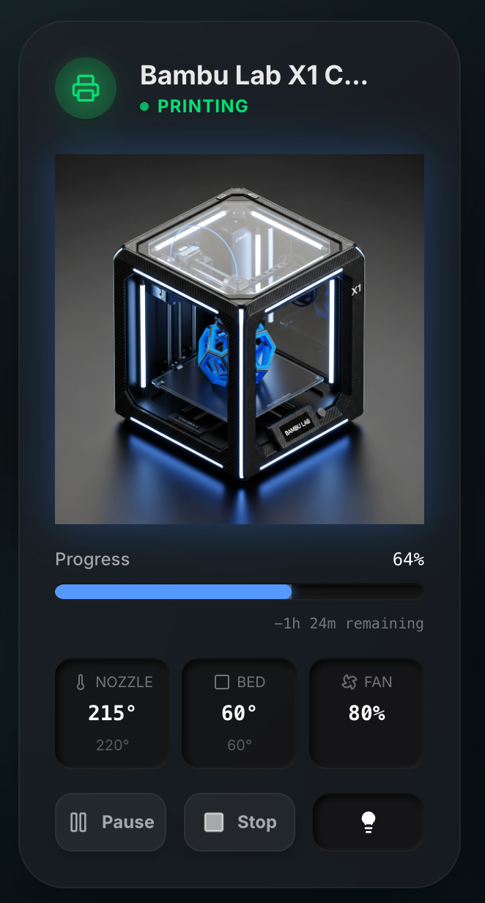

## Custom Cards

> **💡 Tipp:** Nach dem Hinzufügen der Karten zu den Resources kannst du sie im Dashboard-Editor (Vorschau-Teil) finden, indem du z.B. "prism" in die Suche eingibst. Alle Prism-Karten werden dann angezeigt.

---

### prism-heat

Eine benutzerdefinierte Thermostat-Knob-Karte mit Glassmorphism-Design.


**Verwendung:**
```yaml
- type: custom:prism-heat
  entity: climate.living_room
  name: Wohnzimmer
  color: "#fb923c"
```

---

### prism-heat-small

Eine kompakte Heizungs-Karte mit Inlet-Styling und einfachen Temperatur-Controls.


**Verwendung:**
```yaml
- type: custom:prism-heat-small
  entity: climate.living_room
  name: Wohnzimmer
```

---

### prism-button

Eine Glassmorphism-stylisierte Entity-Button-Karte mit Neumorphismus-Effekten und leuchtendem Icon-Kreis.


**Verwendung:**
```yaml
- type: custom:prism-button
  entity: light.living_room_light
  name: Wohnzimmer
  icon: mdi:lightbulb
  layout: horizontal
  active_color: "#ffc864"
```

---

### prism-media

Eine Media-Player-Karte mit Glassmorphism-Design und Inlet-Styling.


**Verwendung:**
```yaml
- type: custom:prism-media
  entity: media_player.living_room_speaker
  playing_color: "#60a5fa"
```

---

### prism-calendar

Eine Kalender-Karte mit Glassmorphism-Design zur Anzeige kommender Termine.


**Verwendung:**
```yaml
- type: custom:prism-calendar
  entity: calendar.family_shared
  max_events: 5
  icon_color: "#f87171"
  dot_color: "#f87171"
```

---

### prism-shutter

Eine horizontale Jalousien-Karte mit Inlet-Slider und Glassmorphism-Design.


**Verwendung:**
```yaml
- type: custom:prism-shutter
  entity: cover.living_room_shutter
  name: Wohnzimmer
```

---

### prism-shutter-vertical

Eine vertikale Jalousien-Karte mit Inlet-Slider und kompaktem Design.


**Verwendung:**
```yaml
- type: custom:prism-shutter-vertical
  entity: cover.bedroom_shutter
  name: Schlafzimmer
```

---

### prism-vacuum

Eine Staubsauger-Roboter-Karte mit Inlet-Styling, Animation und Saugleistungssteuerung.


**Verwendung:**
```yaml
- type: custom:prism-vacuum
  entity: vacuum.robot_vacuum
  name: Staubsauger
```

---

### prism-led

Eine LED-Licht-Karte mit interaktivem Farbrad, Weiß-Temperatur-Steuerung und Helligkeitsregelung.


**Verwendung:**
```yaml
- type: custom:prism-led
  entity: light.living_room_led
  name: Wohnzimmer LED
```

---

### prism-3dprinter

Eine 3D-Drucker-Karte mit Glassmorphism-Design zur Anzeige von Fortschritt, Temperaturen, Lüfter und Layer-Infos.



**Verwendung:**
```yaml
- type: custom:prism-3dprinter
  entity: sensor.3d_printer_state        # Sensor/Entität mit Druckerstatus & Attributen
  name: 3D Printer
  camera_entity: camera.3d_printer       # Optional: Drucker-Kamera
  image: /local/custom-components/images/prism-3dprinter.png
```

---

### prism-bambu

Eine Bambu Lab 3D-Drucker-Karte mit AMS (Automatic Material System) Support, Glassmorphism-Design und vollständiger Anzeige von Druckfortschritt, Temperaturen, Lüfter, Layer-Infos und allen 4 AMS-Slots.


**Verwendung:**

**Basis-Konfiguration (alle Daten aus einer Entity):**
```yaml
- type: custom:prism-bambu
  entity: sensor.x1c_1  # Haupt-Printer Entity (wie X1C_1, bambu_lab_printer, etc.)
  name: Bambu Lab Printer
  camera_entity: camera.x1c_1  # Optional: Camera Entity
  image: /local/custom-components/images/prism-bambu-pic.png  # Optional: Drucker-Bild
```

**Erweiterte Konfiguration (mit zusätzlichen Sensoren):**
```yaml
- type: custom:prism-bambu
  entity: sensor.x1c_1  # Haupt-Printer Entity
  name: Bambu Lab Printer
  camera_entity: camera.x1c_1  # Optional: Camera Entity
  ams_entity: sensor.x1c_1_ams_1  # Optional: Separate AMS Entity (falls nicht in Haupt-Entity)
  temperature_sensor: sensor.custom_nozzle_temp  # Optional: Custom Temperatur-Sensor
  humidity_sensor: sensor.custom_humidity  # Optional: Custom Luftfeuchtigkeits-Sensor
  image: /local/custom-components/images/prism-bambu-pic.png
```

**Hinweis:** Die Karte arbeitet wie die offiziellen [ha-bambulab Cards](https://github.com/greghesp/ha-bambulab-cards) und liest standardmäßig **alle Daten aus den Attributen einer einzelnen Printer-Entity**. Optional können zusätzliche Sensor-Entities konfiguriert werden, z.B. für andere Drucker-Modelle oder Custom-Sensoren.

**Features:**
- ✅ AMS Support: Zeigt alle 4 AMS-Slots mit Farb-Visualisierung
- ✅ Filament-Typ und Restmenge in %
- ✅ Aktiver Slot wird hervorgehoben
- ✅ Camera-Toggle zwischen Printer-Image und Live-Feed
- ✅ Interaktive Buttons für Pause/Stop/Speed
- ✅ Temperatur-Overlays (Nozzle, Bed, Chamber)
- ✅ Fan-Geschwindigkeiten (Part & Aux)
- ✅ Layer-Informationen und Fortschrittsbalken

**Daten aus Printer-Entity Attributen:**

Die Karte liest standardmäßig alle Daten aus den Attributen der Haupt-Printer-Entity:

- **Print Data:** `print_progress` / `progress`, `remaining_time`, `end_time`
- **Temperatures:** `nozzle_temp` / `nozzle`, `target_nozzle_temp`, `bed_temp` / `bed`, `target_bed_temp`, `chamber_temp` / `chamber`
- **Fans:** `cooling_fan_speed` / `cooling`, `aux_fan_speed` / `aux`
- **Layer:** `current_layer`, `total_layer_count` / `total_layers`
- **AMS:** `ams` / `ams_data` / `ams_slots` - Array mit AMS-Slot-Daten (type, color, remaining, active, empty)

**Optional: Zusätzliche Sensor-Entities:**

Falls bestimmte Daten nicht in der Haupt-Entity vorhanden sind, können separate Entities konfiguriert werden:

- **`ams_entity`**: Separate AMS-Entity (z.B. `sensor.x1c_1_ams_1`)
- **`temperature_sensor`**: Custom Temperatur-Sensor (z.B. `sensor.chamber_temperature`)
- **`humidity_sensor`**: Custom Luftfeuchtigkeits-Sensor (z.B. `sensor.chamber_humidity`)

**Beispiel Entity:** `sensor.x1c_1` (Haupt-Printer-Entity mit allen Daten in den Attributen)

**Bild hochladen:**

Das Drucker-Bild muss manuell in Home Assistant hochgeladen werden:
1. Kopiere das Bild nach `/config/www/custom-components/images/prism-bambu-pic.png` (oder `.jpg`)
2. Oder verwende einen anderen Pfad und gib ihn im `image`-Feld an
3. Die Karte unterstützt sowohl `.png` als auch `.jpg` Formate
4. Falls das Bild nicht geladen werden kann, versucht die Karte automatisch die andere Endung (.png ↔ .jpg)
5. Als letzter Fallback wird ein Drucker-Icon angezeigt

**ha-bambulab Integration:**
Die Karte ist kompatibel mit der [ha-bambulab Integration](https://github.com/greghesp/ha-bambulab) und arbeitet wie die [offiziellen Bambu Lab Cards](https://github.com/greghesp/ha-bambulab-cards).

---

### prism-sidebar

Eine vollflächige Sidebar-Karte mit Kamera, Uhr, Kalender, Wetter-Forecast und Energie-Übersicht – ideal für Grid-Layouts mit eigener `sidebar`-Spalte.


**Verwendung (Beispiel mit Grid-Layout):**
```yaml
type: custom:prism-sidebar
camera_entity: camera.garden_main
camera_entity_2: camera.front_door  # Optional: Zweite Kamera
camera_entity_3: camera.backyard    # Optional: Dritte Kamera
rotation_interval: 10               # Optional: Rotationsintervall in Sekunden (3-60, Standard: 10)
weather_entity: weather.home
grid_entity: sensor.power_grid
solar_entity: sensor.power_solar
home_entity: sensor.power_home
calendar_entity: calendar.termine
```

**Hinweis:** Wenn mehrere Kameras konfiguriert sind, rotieren sie automatisch durch. Das Rotationsintervall kann zwischen 3 und 60 Sekunden eingestellt werden.

---

### prism-sidebar-light

Light Theme Version der Sidebar-Karte mit hellem Glassmorphism-Design.


**Verwendung:**
```yaml
type: custom:prism-sidebar-light
camera_entity: camera.garden_main
camera_entity_2: camera.front_door  # Optional: Zweite Kamera
camera_entity_3: camera.backyard    # Optional: Dritte Kamera
rotation_interval: 10               # Optional: Rotationsintervall in Sekunden (3-60, Standard: 10)
weather_entity: weather.home
grid_entity: sensor.power_grid
solar_entity: sensor.power_solar
home_entity: sensor.power_home
calendar_entity: calendar.termine
```

**Hinweis:** Wenn mehrere Kameras konfiguriert sind, rotieren sie automatisch durch. Das Rotationsintervall kann zwischen 3 und 60 Sekunden eingestellt werden.

---

## Layout Components

### navigation-bar


### sidebar


